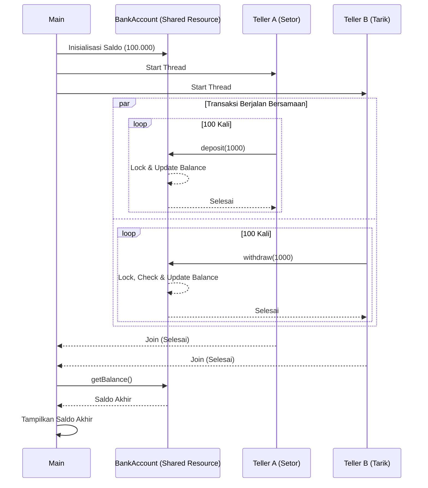

# Dokumentasi Simulasi Sistem Bank Sederhana (Tugas1: concurency)

program ini mensimulasikan sistem perbankan di mana satu akun bank diakses oleh dua teller (thread) secara bersamaan. program ini mendemonstrasikan konsep *concurrency* dan pentingnya sinkronisasi

## 1. Langkah Kerja Program
berikut adalah alur kerja program:



## 2. penjelasan hal2 penting

### A. Sinkronisasi Method (`synchronized`)
keyword `synchronized` digunakan pada method `deposit` dan `withdraw`. ni berfungsi u/ mengunci objek `BankAccount` sehingga hanya satu thread yg bisa mengubah saldo dalam satu waktu. hal ini mencegah terjadinya *race condition* (kondisi dimanba hasil akhir bergantung pada urutan eksekusi thread yang tidak teratur)

```java
public synchronized void deposit(int amount) {
    balance += amount;
    System.out.println(Thread.currentThread().getName() + " setor Rp " + amount + " | Saldo: " + balance);
}
```

### B. proteksi saldo saat penarikan
porgram melakukan pengecekan saldo sebelum melakukan pengurangan. karena berada di dalam method `synchronized`, proses pengecekan hingga pengurangan dilakukan secara atomik (tidak bisa disela oleh thread lain).

```java
public synchronized void withdraw(int amount) {
    if (balance >= amount) {
        balance -= amount;
        System.out.println(Thread.currentThread().getName() + " tarik Rp " + amount + " | Saldo: " + balance);
    } else {
        System.out.println(Thread.currentThread().getName() + " gagal tarik Rp " + amount + " (Saldo tidak cukup)");
    }
}
```

### C. penggunaan `join()` pada thread
method `join()` memastikan bahwa thread utama (`main`) menunggu hingga `threadA` dan `threadB` menyelesaikan seluruh perulangannya sebelum melanjutkan ke baris kode untuk menampilkan saldo akhir. tanpa `join()`, saldo akhir mungkin akan ditampilkan sebelum semua transaksi selesai.

```java
threadA.start();
threadB.start();

try {
    threadA.join();
    threadB.join();
} catch (InterruptedException e) {
    Thread.currentThread().interrupt();
}
```

## 3. cara menjalankan program
1. compile kedua file java:
   ```bash
   javac BankAccount.java BankSimulation.java
   ```
2. run program:
   ```bash
   java BankSimulation
   ```

## 4. Analisis Hasil
karena terdapat 100 kali setoran Rp 1.000 dan 100 kali penarikan Rp 1.000, maka saldo akhir akan kembali ke saldo awal (Rp 100.000), asalkan sinkronisasi berjalan dengan benar. jika keyword `synchronized` dihapus, ada kemungkinan (ada kemungkinan yes) saldo akhir tidak akurat karena adanya tabrakan data saat update nilai `balance`.
